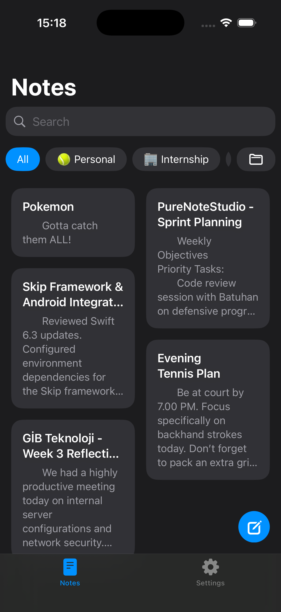
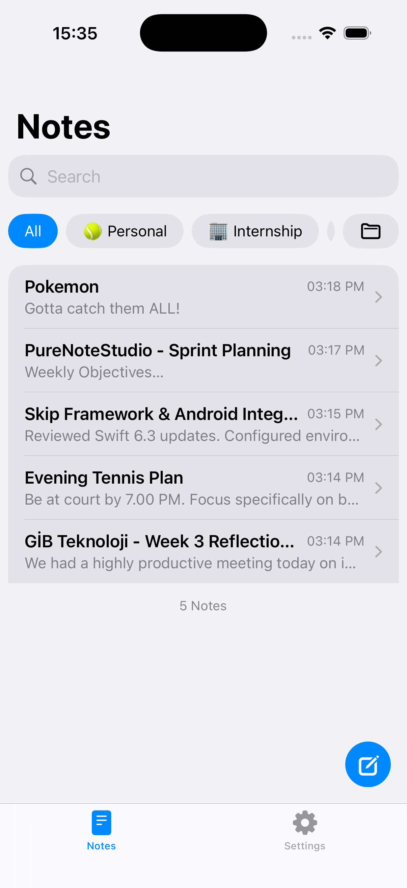
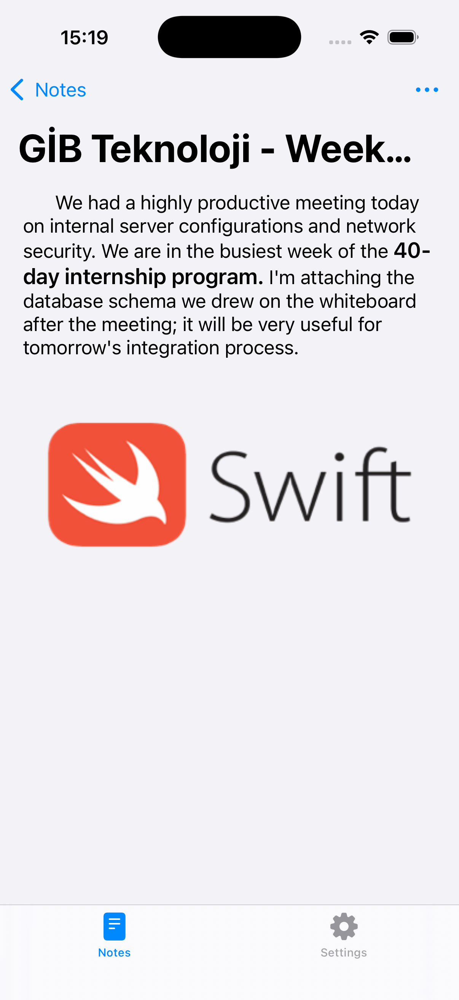
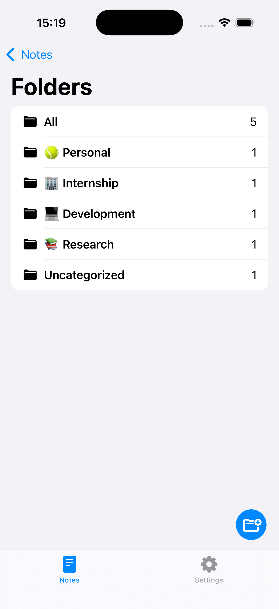
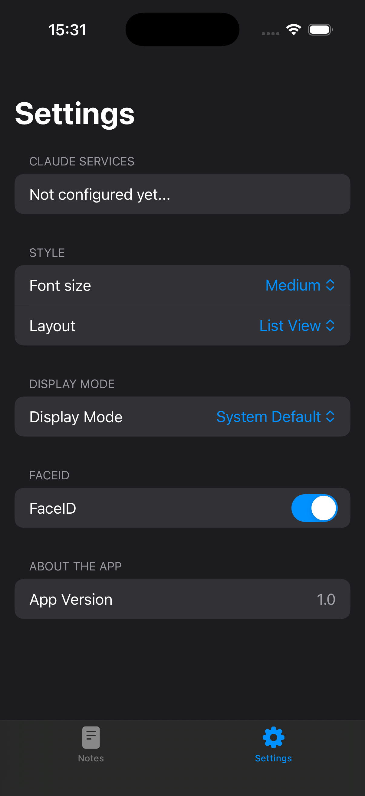
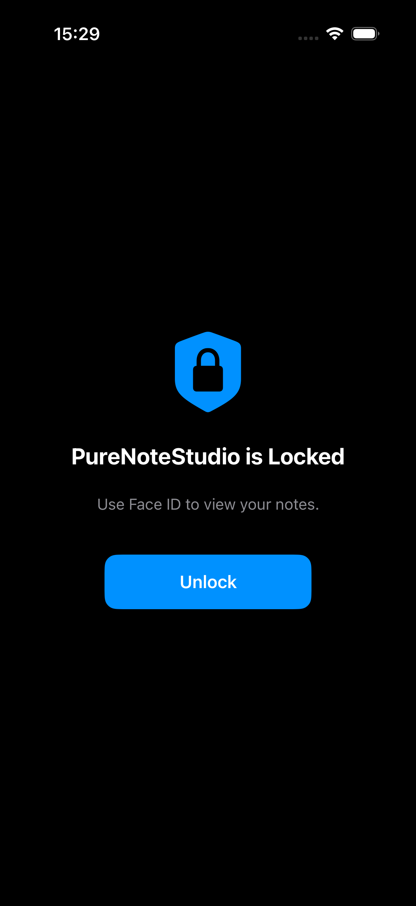
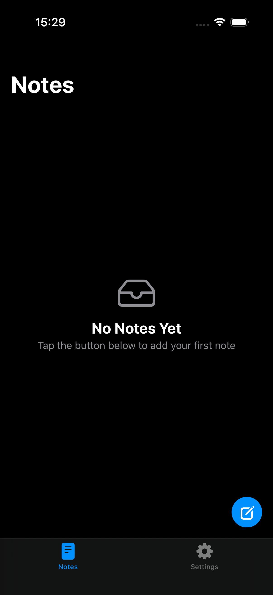

# PureNoteStudio

A modern, privacy-focused note-taking application built with **SwiftUI**, following **MVVM + Repository + Dependency Injection** architecture. PureNoteStudio focuses on clean architecture, maintainable code, and a native iOS experience while demonstrating production-level Swift development practices.

> This project was developed as a portfolio application to showcase scalable SwiftUI architecture and modern iOS development.

---

# Preview

| Grid Layout | List Layout |
|------------|------------|
|  |  |

| Note Detail | Folders |
|-------------|----------|
|  |  |

| Settings | Face ID |
|----------|----------|
|  |  |

| Empty State |
|------------|
|  |

---

# Features

### Notes

- Create notes
- Read notes
- Update notes
- Delete notes
- Rich text support
- Image attachments
- Search notes instantly
- Folder filtering
- Responsive Grid/List layouts
- Empty state support

### Folder Management

- Create folders
- Assign notes to folders
- Move notes between folders
- Uncategorized support

### User Experience

- Native SwiftUI interface
- Light & Dark Mode
- Dynamic Font Size
- Grid/List switching
- Smooth animations
- Floating Action Button
- Adaptive layouts

### Security

- Optional Face ID authentication
- Automatic lock screen
- Secure local authentication

### Settings

- Display Mode
- Layout Mode
- Font Size
- Face ID toggle

---

# Architecture

PureNoteStudio follows a modular MVVM architecture with Repository Pattern and Dependency Injection.

```
SwiftUI View
      │
      ▼
 ViewModel
      │
      ▼
 Repository
      │
      ▼
 Services
      │
      ▼
 Models
```

## Folder Structure

```
PureNoteStudio
│
├── App
│
├── Core
│   ├── Extensions
│   ├── Foundation
│   ├── Interfaces
│   ├── Services
│   └── UIKit
│
├── Models
│
├── Repository
│
├── Routers
│
├── Theme
│
├── Views
│   ├── Components
│   ├── NotesTab
│   │   ├── AddNoteSheet
│   │   ├── Folders
│   │   ├── MoveTo
│   │   ├── NoteDetail
│   │   └── NotesList
│   ├── SettingsTab
│   └── TabView
│
└── Assets
```

---

# Technologies

- Swift 6
- SwiftUI
- MVVM
- Repository Pattern
- Dependency Injection
- Combine
- Observation
- NavigationStack
- LocalAuthentication
- UserDefaults
- PhotosPicker
- Markdown Rendering

---

# Project Structure

### Views

Responsible only for rendering UI and forwarding user actions.

### ViewModels

Contain presentation logic, state management and communicate with repositories.

### Repository

Acts as the abstraction layer between UI and data source.

### Services

Responsible for business logic and system integrations.

Examples:

- Authentication
- Local Storage
- Preferences

### Routers

Centralized navigation handling.

### Theme

Contains reusable colors, fonts and design constants.

---

# Design Principles

- Single Responsibility Principle
- Dependency Injection
- Protocol-Oriented Programming
- Separation of Concerns
- Reusable Components
- Testable Architecture
- Modular Feature Organization

---

# Screens

- Notes Grid
- Notes List
- Search
- Folder List
- Note Detail
- Create Note
- Move Note
- Settings
- Face ID Lock
- Empty State

---

# Getting Started

## Requirements

- Xcode 16+
- iOS 18+
- Swift 6

## Installation

```bash
git clone https://github.com/yourusername/PureNoteStudio.git
```

```bash
cd PureNoteStudio
```

Open

```
PureNoteStudio.xcodeproj
```

Run the project using Xcode.

---

# Future Improvements

- CloudKit synchronization
- Tags
- Pin notes
- Favorites
- Archive
- Widgets
- Share Extension
- Apple Pencil support
- PDF Export
- Drag & Drop
- Multi-window support
- Shortcuts integration

---

# Why this project?

PureNoteStudio was created to demonstrate:

- Clean SwiftUI architecture
- Maintainable MVVM design
- Repository abstraction
- Dependency Injection
- Modern iOS UI development
- Native Apple Human Interface Guidelines
- Scalable project organization

Rather than focusing solely on features, the project emphasizes code quality, modularity, readability, and long-term maintainability.

---

# License

MIT License

Feel free to use this project for learning or inspiration.

---

# Author

**Semih Takılan**

GitHub:
https://github.com/yourusername

LinkedIn:
https://linkedin.com/in/yourprofile
